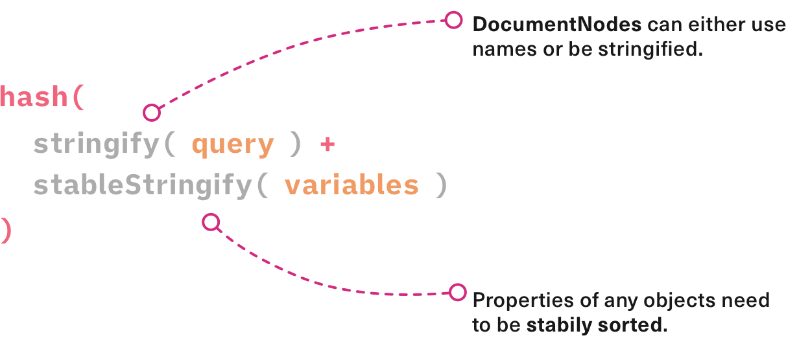
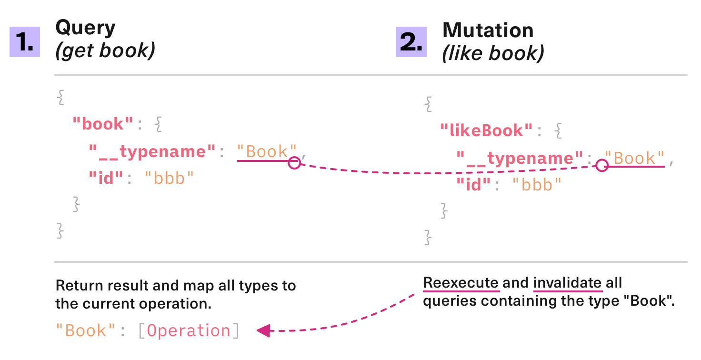

# Document Caching

By default `urql` uses a concept called _Document Caching_. It will avoid sending the same requests
to a GraphQL API repeatedly by caching the result of each query.

This works like the cache in a browser. `urql` creates a key for each request that is sent based on
a query and its variables.

## Operation Keys

Once a result comes in it's cached indefinitely by their key. This means that each unique request
can have exactly one cached result.

However, we also need to invalidate the cache result so new requests for the same data can be
sent when we know that some results are outdated. A result may be outdated because a mutation has
been executed on data that has been queried previously.

In GraphQL the client can request additional type information on a query by adding the `__typename`
field. This field return the name of the type of a piece of data in a requests, and we use it
to detect commonalities and data dependencies between queries and mutations.

When we send a mutation that contains types that another query's results contains as well, that
query's result is removed from the cache.

This is an aggressive form of cache invalidation. However, it works well for content-driven sites,
although it doesn't deal with normalized data or IDs.

## Document Cache Gotchas

This cache has a small trade-off! If we request a list of data and the API returns an empty list,
the cache won't be able to see the `__typename` of said list and won't invalidate.

Once you've encountered this problem you've likely hit the limits of the _Document Caching_
approach, and you may want to [switch to "Normalized Caching"
instead.](../graphcache/normalized-caching.md)
