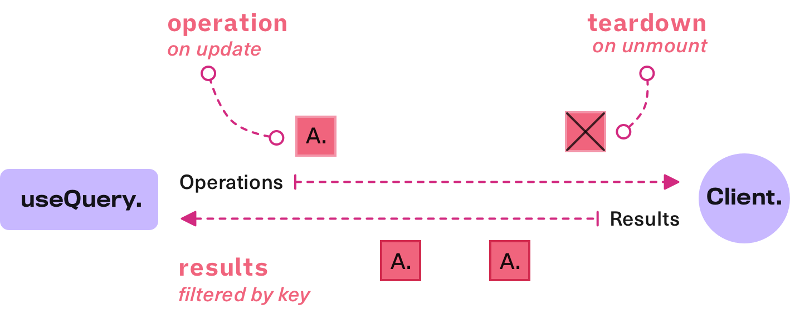
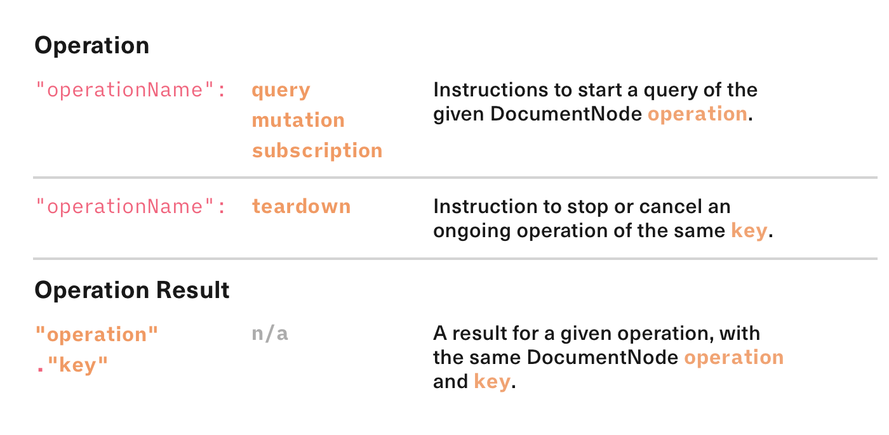

# Philosophy

`urql` is a highly customizable and flexible GraphQL client, that happens to come with some default
[core behavior in the core package](./core-package.md).

By default, we aim to provide features that allow you to build your app quickly with minimal
configuration. `urql` is designed to be a client that grows with you. As you go from building your first
GraphQL app to a utilising the full functionality, the toopls are available to extend and customize `urql` based on
your needs.

In this guide, we will walk through how `urql` is set up internally and how all pieces of the puzzle
— the building blocks of `urql` — interact with one another.

## Hello World

We previously read about how to set up a `Client` in [Getting
Started](../basics/getting-started.md).

When you use `urql` you will always create and set up a `Client`. There is a `createClient`
convenience helper to do just that.

```js
import { Client } from 'urql';

const client = new Client({
  url: 'http://localhost:3000/graphql',
});
```

In `urql`, the client is the first step towards manging the complexity of GraphQL automatically.

## Using GraphQL Clients

You may have worked with a GraphQL API previously and noticed that using GraphQL in your app can be
as straightforward as sending a plain HTTP request with your query to fetch some data.

GraphQL also provides an opportunity to abstract away a lot of the manual work that goes with
sending these queries and managing the data. Ultimately, this lets you focus on building
your app without having to handle the technical details of state management in detail.

Specifically, `urql` simplifies three common aspects of using GraphQL:

- Sending queries and mutations and receiving results _declaratively_
- Abstracting _caching_ and state management internally
- Providing a central point of _extensibility_ and integration with your API

In the following sections we'll talk about how `urql` solves these three problems, and how this is
accomplished and abstracted internally.

## Declarative Queries

When you implement queries or mutations with `urql` the `Client` will internally manage the
lifetime and updates for these _operations_.

Such an _operation_ may be sent to your GraphQL API and you'll subsequently receive results.
When a _cache_ invalidates this result you may receive updated results. When your app
stops being interested in results for an _operation_ (e.g. React unmounts your component) then
the `Client` knows to _teardown_ the _operation_ and stops requesting new data or sending you
results.



This all happens in the background, allowing you to simply declare that you'd like to have data for a given
query.

## Caching and State

When we use GraphQL queries and mutations declaratively with `urql`, we expect them to interact
and update automatically.

Furthermore, when we've already received the results from a query, we may not wish to send another request. To solve this, results can be cached in-memory and notifications can be sent to other parts of an app when the results change or
are invalidated by mutations/subscriptions.

GraphQL clients have access to some type information for any GraphQL API and hence can
cache the results of queries automatically. In `urql` the `Client` can be extended with several
cache implementations; all of them allow you to prevent mixing your declarative query or mutation
code with cache-implementation details, as they mostly happen behind the scenes.

We previously read about the default [Document Caching](../basics/document-caching.md).

Some GraphQL clients also resort to caching data in a normalized format. This is similar to
[how you may store data in Redux.](https://redux.js.org/recipes/structuring-reducers/normalizing-state-shape/)
Using this approach the cache uses more type information to reference parts of the GraphQL only once
in the cache and structures it in a graph, which leads to more shared data, and hence more shared
updates in your UI!

[Read more](../graphcache/normalized-caching.md) on how to add Normalized Caching to an app.

## Extensibility and Integration

With any kind of API there can be concerns outside of caching and state mangagement. For example,
the global behavior or business logic of your application. For instance, you may want to add authentication, retry-logic for failed requests, or a global
error handler.

`urql` introduces the concept of _Exchanges_ in order to abstract the details of how the `Client` interacts with
your framework of choice, your app, and your GraphQL API. They are akin to
[middleware in Redux](https://redux.js.org/advanced/middleware) and have access to all operations
and all results.

Read more about [Exchanges](./exchanges.md) later on in the documentation.

All default behavior in the [core package](./core-package.md) is implemented using
Exchanges. This is possible as all operations and all results are treated as a stream
of events; we call these events "Operations".



Thinking about GraphQL queries and results in
streams of operations and results allow us to implement complex behaviour in addition to allowing deep customisation over how the operations/results are handled. We'll learn more about this in the next section - [the Core Package](./core-package.md).
